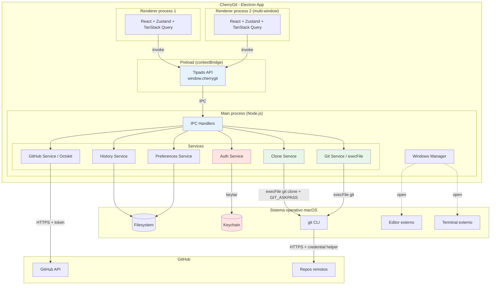

# CherryGit - Arquitectura Técnica

**Versión**: 1.0
**Fecha**: 2026-04-20
**Autor**: Equipo Consiss (rol /architect)
**Base**: `kb-web/docs/cherry-pick/backlog-v1.md` + `kb-web/docs/cherry-pick/requerimientos-app-mac.md`

---

## 1. Análisis

### 1.1 Requerimientos funcionales clave (del backlog)

| ID | Epica | Resumen |
|---|---|---|
| E1 | Auth | Login con PAT de GitHub + persistencia en Keychain + logout |
| E2 | Repos | Listar repos del usuario via API + clone on-demand |
| E3 | Ramas | Seleccionar ramas origen/destino (locales + `origin/*`) |
| E4 | Commits | Filtrar por rango de fechas + checkboxes + orden cronologico ascendente |
| E5 | Inspeccion | Ver mensaje completo + archivos modificados por commit |
| E6 | Ejecucion | Pipeline: clean tree → fetch → checkout → pull ff-only → cherry-pick |
| E7 | Conflictos | Detectar, pausar, ofrecer Continuar/Abortar |
| E8 | Historial | Log persistente de operaciones |
| E9 | Preferencias | Editor, terminal, defaults |
| E10 | Multi-ventana | Varias ventanas simultaneas |
| E11 | Empaquetado | `.dmg` para macOS (Apple Silicon + Intel) |

### 1.2 Requerimientos no funcionales

- **Plataforma**: macOS 13+ (v1). Cross-platform Windows/Linux factible (Electron) para futuras versiones.
- **Seguridad**: token en Keychain (nunca en disco plano), git con `execFile` (sin shell), validacion de SHAs.
- **Performance**: listar 30 dias de commits en <2s, UI no bloqueante durante operaciones git.
- **UX**: atajos Mac (`Cmd+N`, `Cmd+,`, `Cmd+R`, etc.), modo oscuro/claro automatico, notificaciones nativas.
- **Observabilidad**: log local en `~/Library/Logs/CherryGit/app.log`.
- **Sin telemetria remota** (100% local).

### 1.3 Restricciones tecnicas

- Electron (Chromium + Node.js) — decisión ya tomada.
- Uso interno, sin firma Apple Developer en v1 (usuario debe "clic derecho → Abrir" la primera vez).
- Sin CI/CD automatico; build manual local.
- No push automatico; el usuario empuja cuando valide.

### 1.4 Riesgos tecnicos

| # | Riesgo | Severidad | Mitigacion |
|---|---|---|---|
| R1 | Token filtrado a `.git/config` al clonar con HTTPS+token | Alta | Usar `GIT_ASKPASS` con helper efimero o `osxkeychain` credential helper |
| R2 | Comandos git largos bloquean UI | Media | Ejecutar en main process via IPC; stream progreso en stdout |
| R3 | Concurrencia multi-ventana escribiendo `history.json` | Media | Lock con `proper-lockfile` o centralizar en main process |
| R4 | Rate limit de GitHub API al listar repos | Baja | Cache con TTL 5 min en main process |
| R5 | Estado inconsistente post-conflicto (app cerrada mid cherry-pick) | Media | Detectar `CHERRY_PICK_HEAD` al abrir repo y ofrecer continuar/abortar |
| R6 | Clone on-demand pesado (repos grandes) | Media | Mostrar progreso stdout en vivo; permitir cancelar |
| R7 | Editor/terminal no instalado al abrir-en-editor | Baja | Detectar disponibilidad al guardar preferencia |

---

## 2. Tech Stack

| Componente | Tecnologia | Version | Justificacion |
|---|---|---|---|
| Runtime desktop | **Electron** | 30.x | Decision del usuario. Stack ya validado con prototipo web. |
| Node | **Node 20 LTS** | 20.x | Soporte Electron 30+. Estable. |
| Empaquetador/build | **electron-vite** + **electron-builder** | latest | HMR en dev, build `.dmg` universal en una corrida. |
| Renderer framework | **React** | 18.x | Maduro, ecosistema; buena integracion con Electron. |
| Lenguaje | **TypeScript** | 5.x | Tipado end-to-end (main + preload + renderer). |
| UI / CSS | **Tailwind CSS** | 4.x | Consistencia con `kb-web/`. |
| Componentes UI | **Radix UI** (primitives) + custom | latest | Accesibilidad + Mac-friendly sin imponer diseño pesado. |
| Estado global renderer | **Zustand** | 4.x | Liviano, sin boilerplate, tipado. |
| Data fetching renderer | **TanStack Query** | 5.x | Cache, revalidacion, manejo de errores para GitHub API. |
| Cliente GitHub API | **@octokit/rest** | 21.x | Decision del usuario. Paginacion + rate limit handling nativo. |
| Git backend | **execFile** nativo (`child_process`) | — | Ya validado en `kb-web/server/cherry-pick.mjs`. Reusable. |
| Keychain | **keytar** | 7.x | De facto estandar, funciona en macOS/Win/Linux. |
| Persistencia settings | **electron-store** | 10.x | JSON tipado, simple, con schema. |
| Persistencia historial | Filesystem directo (`fs/promises` + JSON lines) | — | Append-only, rota a 10MB. |
| File lock | **proper-lockfile** | 4.x | Coordinar escritura entre ventanas. |
| Testing unit | **Vitest** | 2.x | Rapido, compatible con Vite. |
| Testing E2E | **Playwright** (`@playwright/test`) con soporte Electron | 1.x | Valida flujos completos main + renderer. |
| Linter | **ESLint** + `@typescript-eslint` | 9.x | Estandar. |
| Formatter | **Prettier** | 3.x | Estandar. |
| Iconos | **Lucide React** | latest | Consistente, MIT, Mac-friendly. |

---

## 3. Arquitectura de procesos (Electron)

Electron divide la app en tres tipos de procesos. CherryGit los organiza asi:

### 3.1 Main process (Node.js)
Responsable de:
- Ciclo de vida de la app (open, close, quit).
- Manejo de ventanas (BrowserWindow).
- Operaciones privilegiadas: acceso a filesystem, child_process para git, Keychain via keytar.
- Cliente Octokit para GitHub API.
- Persistencia en `~/Library/Application Support/CherryGit/`.
- Coordinacion multi-ventana (una instancia compartida de token, settings, historial).
- Menu nativo macOS.

### 3.2 Preload scripts (bridge seguro)
Responsable de:
- Exponer APIs controladas del main al renderer via `contextBridge`.
- Nunca exponer `ipcRenderer` crudo ni Node APIs.

### 3.3 Renderer processes (Chromium)
- Una instancia por ventana.
- React + TypeScript + Tailwind.
- Llama al main via IPC promise-based (`invoke`).
- No accede a filesystem, git, ni Keychain directamente.

### 3.4 Modelo de seguridad Electron

| Config | Valor | Por que |
|---|---|---|
| `contextIsolation` | `true` | Aisla el contexto del preload del contexto del renderer |
| `nodeIntegration` | `false` | Renderer no tiene acceso a Node APIs |
| `sandbox` | `true` | Renderer corre en sandbox de Chromium |
| `webSecurity` | `true` | Respeta CORS, CSP |
| CSP (Content Security Policy) | restrictiva (`script-src 'self'`) | Bloquea XSS |
| `allowRunningInsecureContent` | `false` | Evita contenido mixto HTTP/HTTPS |

---

## 4. Diseño de modulos

### 4.1 Main process (`src/main/`)

```
src/main/
├── index.ts                  # Bootstrap Electron, crea primera ventana
├── windows/
│   ├── manager.ts            # Crear/gestionar BrowserWindows
│   └── menu.ts               # Menu nativo macOS (File > New Window, etc.)
├── ipc/
│   ├── register.ts           # Registra handlers de ipcMain.handle
│   ├── auth.handlers.ts      # login, logout, getSession
│   ├── repos.handlers.ts     # listRepos, cloneRepo, getLocalClone
│   ├── git.handlers.ts       # listBranches, listCommits, inspect, execute, continue, abort
│   ├── history.handlers.ts   # saveEntry, listEntries, exportCsv
│   └── preferences.handlers.ts
├── services/
│   ├── auth.service.ts       # keytar + validacion de token GitHub
│   ├── github.service.ts     # Octokit wrapper: listRepos paginado, rate limit
│   ├── git.service.ts        # Portado de kb-web/server/cherry-pick.mjs
│   ├── clone.service.ts      # git clone con GIT_ASKPASS helper
│   ├── conflict.service.ts   # Detectar estado cherry-pick + resolucion
│   ├── history.service.ts    # Append + lectura + rotacion de history.json
│   ├── preferences.service.ts # electron-store wrapper
│   └── notification.service.ts
├── utils/
│   ├── paths.ts              # Paths a app dirs (Support, Logs)
│   ├── validators.ts         # validateSha, validateRepoName
│   ├── logger.ts             # Winston/Pino con rotacion
│   └── lock.ts               # proper-lockfile wrapper
└── types/
    └── domain.ts             # Commit, Repo, Session, HistoryEntry, etc.
```

### 4.2 Preload (`src/preload/`)

```
src/preload/
└── index.ts                  # contextBridge.exposeInMainWorld('cherrygit', api)
```

La API expuesta al renderer es tipada:

```ts
interface CherryGitAPI {
  auth: {
    getSession(): Promise<Session | null>;
    login(token: string): Promise<Session>;
    logout(): Promise<void>;
  };
  repos: {
    list(): Promise<Repo[]>;
    clone(owner: string, name: string, onProgress?: (p: Progress) => void): Promise<void>;
    getLocalClones(): Promise<LocalRepo[]>;
  };
  git: {
    listBranches(repoId: string): Promise<Branches>;
    listCommits(repoId: string, branch: string, since: string, until?: string): Promise<Commit[]>;
    inspect(repoId: string, shas: string[]): Promise<CommitDetail[]>;
    execute(params: ExecuteParams): Promise<ExecuteResult>;
    continueOp(repoId: string, pendingShas: string[], opts: { useX: boolean }): Promise<ExecuteResult>;
    abort(repoId: string): Promise<AbortResult>;
    getStatus(repoId: string): Promise<RepoStatus>;
  };
  history: {
    list(filters?: HistoryFilters): Promise<HistoryEntry[]>;
    export(format: 'json' | 'csv'): Promise<string>;
  };
  preferences: {
    get(): Promise<Preferences>;
    set(prefs: Partial<Preferences>): Promise<void>;
  };
  system: {
    openInEditor(path: string): Promise<void>;
    openInTerminal(path: string): Promise<void>;
    openInFinder(path: string): Promise<void>;
  };
}
```

### 4.3 Renderer (`src/renderer/`)

```
src/renderer/
├── index.html
├── main.tsx                  # React bootstrap
├── App.tsx                   # Router + provider
├── routes/
│   ├── login/                # E1
│   │   └── LoginPage.tsx
│   ├── repos/                # E2
│   │   ├── RepoListPage.tsx
│   │   └── CloneDialog.tsx
│   ├── repo/                 # E3-E7
│   │   ├── RepoPage.tsx
│   │   ├── BranchSelector.tsx
│   │   ├── DateRangeFilter.tsx
│   │   ├── CommitList.tsx
│   │   ├── CommitDetailPanel.tsx
│   │   ├── ExecuteButton.tsx
│   │   ├── ConfirmModal.tsx
│   │   ├── ExecuteProgress.tsx
│   │   ├── ConflictPanel.tsx
│   │   └── ResultSummary.tsx
│   ├── history/              # E8
│   │   └── HistoryPage.tsx
│   └── preferences/          # E9
│       └── PreferencesPage.tsx
├── components/
│   ├── layout/               # AppShell, Sidebar, TopBar
│   ├── ui/                   # Button, Input, Select, Modal (wrappers de Radix)
│   └── feedback/             # Toast, Spinner, Notification
├── stores/
│   ├── session.store.ts      # Zustand: sesion de auth
│   ├── window.store.ts       # Zustand: estado de la ventana (repo actual, commits, seleccion)
│   └── preferences.store.ts  # Zustand: preferencias
├── hooks/
│   ├── useRepos.ts           # TanStack Query wrappers
│   ├── useCommits.ts
│   ├── useCherryPick.ts
│   └── useShortcuts.ts       # Atajos de teclado Mac
├── lib/
│   ├── api.ts                # window.cherrygit wrapper tipado
│   └── utils.ts
└── styles/
    └── globals.css           # Tailwind base + tema oscuro/claro
```

### 4.4 Tipos compartidos

`src/shared/types.ts` — compartidos entre main, preload y renderer:

```ts
export interface Session {
  user: { login: string; email?: string; avatarUrl: string };
  scopes: string[];
}

export interface Repo {
  owner: string;
  name: string;
  fullName: string;  // owner/name
  description?: string;
  defaultBranch: string;
  visibility: 'public' | 'private';
  updatedAt: string;
  localPath?: string;  // si esta clonado
}

export interface Commit {
  fullSha: string;
  shortSha: string;
  author: string;
  date: string;
  subject: string;
}

export interface ExecuteResult {
  success: boolean;
  steps: StepResult[];
  results: CommitApplyResult[];
  conflict?: boolean;
  conflictAt?: string;
  error?: string;
  repo: string;
  targetBranch?: string;
  note?: string;
}

export interface HistoryEntry {
  timestamp: string;
  repo: string;
  sourceBranch: string;
  targetBranch: string;
  originalShas: string[];
  newShas: string[];
  result: 'success' | 'conflict' | 'aborted';
  durationMs: number;
}

// ... resto de tipos
```

---

## 5. Patrones de diseño

| Patron | Aplicacion | Por que |
|---|---|---|
| **Layered architecture** | main: handlers → services → utils | Aislar IPC de logica de negocio. Facilita testing y reuso. |
| **Adapter pattern** | `git.service.ts` envuelve `execFile` | Aisla CLI de git del resto; si cambia el mecanismo (ej. nodegit), solo cambia el adapter. |
| **Repository pattern** | `history.service.ts` y `preferences.service.ts` | Abstrae storage; facilita tests con mocks. |
| **Command pattern** | Operaciones git como objetos (`ExecuteCherryPickCommand`) | Permite undo potencial, logging uniforme, serializacion al historial. |
| **Facade** | `window.cherrygit` via preload | Superficie minima y controlada al renderer. |
| **Observer / Event emitter** | Progreso de clone y cherry-pick via IPC events | Streams de progreso sin polling. |
| **Strategy** | Editor/terminal abiertos segun preferencia | Intercambiable sin tocar llamadores. |

---

## 6. Estructura de proyecto

```
11. CherryGit/
├── docs/
│   ├── architecture.md         (este archivo)
│   ├── adr/
│   │   ├── 0001-stack-electron.md
│   │   ├── 0002-ipc-contextbridge.md
│   │   ├── 0003-token-keychain.md
│   │   ├── 0004-clone-credential-helper.md
│   │   ├── 0005-multi-window-state.md
│   │   └── 0006-conflict-resolution-flow.md
│   └── diagrams/
│       └── arch-overview.mmd
├── src/
│   ├── main/
│   ├── preload/
│   ├── renderer/
│   └── shared/
├── tests/
│   ├── unit/
│   │   ├── main/
│   │   │   ├── git.service.test.ts
│   │   │   ├── auth.service.test.ts
│   │   │   └── history.service.test.ts
│   │   └── renderer/
│   │       └── components/
│   └── e2e/
│       ├── flows/
│       │   ├── login.spec.ts
│       │   ├── clone-repo.spec.ts
│       │   ├── cherry-pick-happy.spec.ts
│       │   └── cherry-pick-conflict.spec.ts
│       └── fixtures/
│           └── test-repos/     # Repos git de fixture para pruebas
├── resources/
│   ├── icon.icns               # Icono Mac
│   ├── icon.png                # Icono generico
│   └── dmg-background.png
├── scripts/
│   └── generate-icons.mjs      # Genera iconos desde un PNG master
├── electron.vite.config.ts
├── electron-builder.yml
├── tsconfig.json
├── tsconfig.node.json
├── tsconfig.web.json
├── package.json
├── .eslintrc.cjs
├── .prettierrc
├── .gitignore
└── README.md
```

### Notas sobre la estructura

- **`src/main` y `src/renderer` tienen tsconfig separado**: main corre en Node, renderer en Chromium. Evita leaks de tipos cruzados.
- **`src/shared/types.ts`** es la unica importacion cruzada permitida.
- **No hay folder `dist/`** en control de versiones; se genera en build.
- **`resources/`** contiene assets del empaquetado (no del renderer).

---

## 7. Flujos principales (diagramas de secuencia simplificados)

### 7.1 Login con token

```
Usuario → Renderer → Preload → Main
  1. Pega token en LoginPage
  2. renderer.api.auth.login(token)
  3. ipcRenderer.invoke('auth:login', token)
  4. AuthService.login:
     - Octokit con el token → GET /user
     - Si 200: keytar.setPassword('CherryGit', 'github-token', token)
     - Return { session }
  5. Zustand session.store guarda session
  6. Router navega a /repos
```

### 7.2 Listar + clonar repos

```
RepoListPage mount
  → useRepos() (TanStack Query)
  → api.repos.list()
  → GitHubService.listAll(): Octokit paginado /user/repos
  → Cruza con filesystem (~/Library/Application Support/CherryGit/repos/)
  → Marca cuales estan clonados

Usuario elige repo no clonado
  → CloneDialog abre
  → api.repos.clone(owner, name, onProgress)
  → CloneService:
      - Setea GIT_ASKPASS a un helper que imprime el token
      - execFile git clone https://github.com/<owner>/<name>.git <path>
      - Stream stdout via ipcMain.send('clone:progress', { repo, msg })
  → Renderer escucha onProgress, actualiza UI
```

### 7.3 Cherry-pick con conflicto

```
Usuario selecciona commits + click Ejecutar
  → ConfirmModal
  → api.git.execute({ repo, targetBranch, shas, useX })
  → GitService.execute:
      1. status --porcelain (if dirty → return error)
      2. fetch --all --prune
      3. checkout targetBranch
      4. pull --ff-only
      5. for sha in shas:
           cherry-pick -x sha
           si falla: return { success: false, conflict: true, conflictAt: sha, results }
  → ConflictPanel muestra boton Continuar / Abortar

Usuario resuelve archivos fuera de app (editor) + git add
  → Click Continuar
  → api.git.continueOp(repo, pendingShas, { useX })
  → GitService.continueCherryPick:
      - si hasUnresolvedMarkers → return error
      - git -c core.editor=true cherry-pick --continue
      - for sha in pendingShas: cherry-pick -x sha
  → ResultSummary muestra tabla final
  → api.history.saveEntry(...)
```

---

## 8. Seguridad

### 8.1 Token de GitHub

- **Almacenamiento**: exclusivamente en Keychain de macOS via `keytar`. Service name: `CherryGit`, account: `github-token`.
- **Scope minimo requerido**: `repo` (para ver/clonar privados). Se valida al login via `X-OAuth-Scopes` header.
- **Nunca**: logs, archivos de config, variables de entorno persistentes, `.git/config`.
- **Uso en git clone**: via `GIT_ASKPASS` con un helper script que imprime el token en stdout (consumido por git y descartado). No se escribe a URL de remote.
- **Logout**: elimina el secret de Keychain y fuerza a todas las ventanas a volver a la LoginPage.

### 8.2 Validacion de input

- **SHA**: regex `^[0-9a-f]{4,40}$` antes de pasar a git.
- **Nombre de repo**: debe existir en la lista devuelta por Octokit; no se acepta input crudo del renderer.
- **Ramas**: deben existir en `git branch -a` del repo; validacion antes de `checkout`.
- **Fechas**: regex `^\d{4}-\d{2}-\d{2}$`.
- **Paths**: no se acepta path absoluto desde renderer; main resuelve a `<APP_SUPPORT>/repos/<owner>/<name>`.

### 8.3 Ejecucion de comandos externos

- **Siempre `execFile`** (nunca `exec` con shell).
- **Argumentos como array**: `execFile('git', ['checkout', branch])`.
- **Variables de entorno controladas**: solo `GIT_ASKPASS` y `PATH` heredado, nada mas.

### 8.4 IPC

- Solo se exponen metodos especificos via `contextBridge`. Nada de `ipcRenderer` crudo.
- Cada handler valida su payload (zod schemas en `src/main/ipc/schemas.ts`).
- Respuestas tipadas; errores serializados sin stack traces del backend.

### 8.5 Filesystem

- Escrituras limitadas a `~/Library/Application Support/CherryGit/` y `~/Library/Logs/CherryGit/`.
- Repos clonados bajo `~/Library/Application Support/CherryGit/repos/`.
- Lecturas de `/` solo via execFile git en repos validos.

### 8.6 Web security (renderer)

- `contextIsolation: true`, `nodeIntegration: false`, `sandbox: true`.
- CSP: `default-src 'self'; script-src 'self'; style-src 'self' 'unsafe-inline'; img-src 'self' data: https://avatars.githubusercontent.com;`
- `allowRunningInsecureContent: false`.
- No se cargan URLs externas en BrowserWindow (solo `file://` del bundle).

### 8.7 Logs

- `~/Library/Logs/CherryGit/app.log` con rotacion diaria.
- **Nunca loggear**: token, contenido de archivos del repo, mensajes completos de commits con datos sensibles.
- **Si loggear**: comandos git ejecutados (sin token), errores con stack, metricas de performance.

---

## 9. Estrategia de testing

### 9.1 Unit tests (Vitest)

- **main/services/**: git, auth, history, preferences, github — con fixtures de repos locales.
- **main/utils/**: validators, paths.
- **renderer/stores/**: Zustand stores.
- **renderer/components/**: puros, con React Testing Library.
- Coverage objetivo: **80% en services del main**.

### 9.2 Integration tests

- **IPC contracts**: main handlers con `ipcMain.emit` simulado.
- **GitHub service**: contra server MSW que mockea Octokit responses.
- **Clone service**: contra un bare repo local (no HTTPS real).

### 9.3 E2E (Playwright Electron)

Flujos criticos cubiertos:
1. `login.spec.ts`: ingresar token valido, ingresar token invalido, logout.
2. `clone-repo.spec.ts`: seleccionar repo no clonado, clonar, verificar en filesystem.
3. `cherry-pick-happy.spec.ts`: flujo completo exitoso.
4. `cherry-pick-conflict.spec.ts`: provocar conflicto, verificar botones Continue/Abort.
5. `multi-window.spec.ts`: abrir 2 ventanas, operar en paralelo, verificar aislamiento.
6. `preferences.spec.ts`: cambiar editor, persistir, reabrir.

---

## 10. Deploy / empaquetado

### 10.1 Build local (dev)

```bash
npm install
npm run dev         # electron-vite dev (HMR main + renderer)
```

### 10.2 Build de release

```bash
npm run build       # TypeScript check + bundle
npm run dist:mac    # electron-builder --mac → dist/CherryGit-<version>.dmg
```

### 10.3 Configuracion `electron-builder.yml`

- Target: `dmg`.
- Arch: `arm64` + `x64` (universal si conviene).
- `productName: CherryGit`.
- Sin firma por ahora (`mac.identity: null`).
- Background del DMG custom (`resources/dmg-background.png`).

### 10.4 Primera instalacion

- Usuario descarga `.dmg`, abre, arrastra a Applications.
- Primera vez: clic derecho en `CherryGit.app` → Abrir → Abrir (bypass Gatekeeper).
- README documenta el paso.

---

## 11. Consideraciones futuras (fuera de v1 pero pensadas en el diseño)

- **Cross-platform Windows/Linux**: la arquitectura no tiene codigo Mac-only critico. Solo cambian paths (ya abstraidos en `utils/paths.ts`) y el icono. `keytar` funciona en los 3 SOs.
- **Auto-update**: agregar `electron-updater` con feed en GitHub Releases. Minimo cambio en main.
- **Resolver conflictos in-app**: agregar componente de diff editor (ej. Monaco) en v2.
- **Push automatico**: agregar step al final del pipeline controlado por preferencia.
- **Otros providers** (GitLab, Bitbucket): extraer `GitHubService` a interfaz `VcsProvider`; agregar implementaciones.

---

## 12. Diagrama de arquitectura



---

## 13. Proximos pasos

1. **Validar esta arquitectura** con el usuario.
2. Generar ADRs individuales en `docs/adr/` (se incluyen en entrega siguiente si se aprueba esta).
3. Pasar el control a **`/dev-backend`** para:
   - Scaffold inicial con `electron-vite create` + plantilla React + TS.
   - Setup de ESLint, Prettier, Vitest, Playwright.
   - Implementacion de E1 (auth), E2 (repos + clone) y E3-E6 (git services) en Sprint 1-2.
4. Pasar en paralelo a **`/dev-frontend`** para:
   - AppShell + routing + theme oscuro/claro.
   - Pantallas Login + RepoList (E1-E2).
5. Coordinar via **`/pm-status`** el avance del Sprint 1.

---

## 14. Decisiones abiertas (bajo impacto, se pueden diferir)

1. Si queremos ofrecer **auto-stash** al ejecutar cherry-pick con working tree dirty (actualmente: abortamos con mensaje). Propuesta: agregar opt-in en preferencias v1.1.
2. **Busqueda de commits por texto** adicional al filtro in-memory (ej. `git log --grep`): descartado en v1 segun backlog, validar si se requiere.
3. **Icono final** de la app: 3 opciones en `resources/icon-option-{a,b,c}.svg` pendientes de elegir.

## 15. Tema (decidido 2026-04-20)

Switch de tema soporta **3 modos** persistidos en preferencias:

- **`system`** (default) — sigue el tema del SO via `nativeTheme.on('updated')`.
- **`light`** — fuerza tema claro.
- **`dark`** — fuerza tema oscuro.

Implementacion:
- Store: `preferences.theme: 'system' | 'light' | 'dark'` en `electron-store`.
- Main process escucha `nativeTheme.shouldUseDarkColors` si el modo es `system`.
- Renderer suscrito via IPC event `theme:changed`; aplica clase `dark`/`light` al `<html>`.
- Switch visible en TopBar (3-way toggle) y en Preferencias.

---

**Fin del documento**
